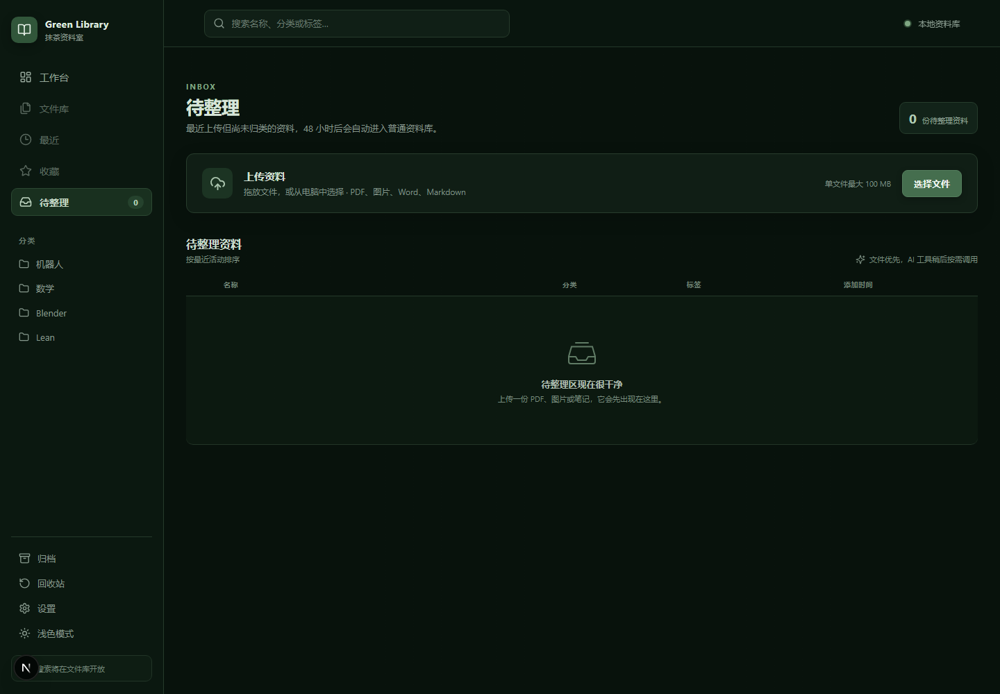

# knowchat7958

一个以“个人文件与知识管理”为核心的本地优先资料库。文件管理是主功能，AI 搜索、阅读和问答作为按需调用的辅助能力。



## 当前功能

- 深抹茶暗色资料库界面，并支持明暗主题切换
- 文件拖放与批量上传，单文件默认最大 100 MB
- SHA-256 内容寻址存储与重复文件检测
- 待整理 Inbox，超过 48 小时可自动进入普通资料库
- 最近使用页面与可自定义服务器封面
- PDF、图片、文本、Markdown、音频和视频浏览器预览
- PostgreSQL 中的分类、标签、评论、归档和回收站数据模型
- 联网新闻搜索、AI 对话、文章生成与独立图片页面
- 本地文件存储与数据库事务补偿，上传失败自动清理临时文件

Office 文件目前提供下载入口。部署到服务器后，可继续接入 OnlyOffice 或 Collabora Online。

## 技术栈

- Next.js 15
- React 19
- TypeScript
- PostgreSQL 16
- pnpm
- Busboy 流式上传

## 本地运行

要求：Node.js 22+、pnpm、PostgreSQL 16。

```powershell
pnpm install
Copy-Item .env.example .env.local
pnpm dev
```

然后访问：

- 资料上传：<http://localhost:3000/inbox>
- 最近使用：<http://localhost:3000/recent>
- 新闻与 AI：<http://localhost:3000>

## 环境变量

在 `.env.local` 中配置：

```dotenv
DATABASE_URL=postgres://用户名:密码@localhost:5432/数据库名
LIBRARY_DATA_DIR=./data
MAX_UPLOAD_BYTES=104857600

TAVILY_API_KEY=
OPENAI_API_KEY=
OPENAI_BASE_URL=
OPENAI_MODEL=
```

`.env.local`、`data/`、`node_modules/` 和构建缓存均已忽略，不应提交到仓库。

## 数据库初始化

按顺序执行：

```powershell
psql -d 数据库名 -f db/init/001_schema.sql
psql -d 数据库名 -f db/init/002_library_schema.sql
```

两份 SQL 迁移均可重复执行。资料库核心表包括：

- `collections`
- `library_items`
- `files`
- `tags` / `item_tags`
- `item_comments`
- `comment_attachments`

## 文件存储

默认目录结构：

```text
data/
├─ library/    # 正式文件，按 SHA-256 前两位分桶
├─ temp/       # 上传临时文件
├─ trash/      # 回收站文件
└─ ui/         # 自定义资料库封面等界面资源
```

正式文件路径示例：

```text
ab/abcdef0123456789....pdf
```

## 常用命令

```powershell
npx tsc --noEmit
pnpm build
pnpm test:storage
```

## 主要接口

```text
POST   /api/files/upload
GET    /api/files/{fileId}/content
GET    /api/library
GET    /api/library/cover
POST   /api/library/cover
DELETE /api/library/cover
```

## 当前阶段

上传、存储、查重、数据库事务、待整理页面、最近页面和基础阅读层已经可用。下一阶段主要是文件库分类操作、收藏/归档/回收站，以及服务器端 Office 阅读组件。
